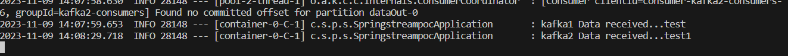

# Getting Started

### Reference Documentation
For further reference, please consider the following sections:

* https://docs.spring.io/spring-cloud-stream/reference/4.1/spring-cloud-stream/producing-and-consuming-messages.html

### Objective
1. Spring boot application able to listen to 2 different topics hosted @ 2 differnt clusters, using auto-configuration.

### working of the application

1. excute  'docker-compose up' or 'docker-compose up --build'
2. After successful execution 2 kafka instances will be up and running @ ports 9092 AND 19092
3. Yon can monitor the kafka's @  localhost:8080 AND localhost:8081
4. excute the application.
5. you can publish the message using localhost:8080 AND localhost:8081 AND obsever the output in your console.

### output screen shot

